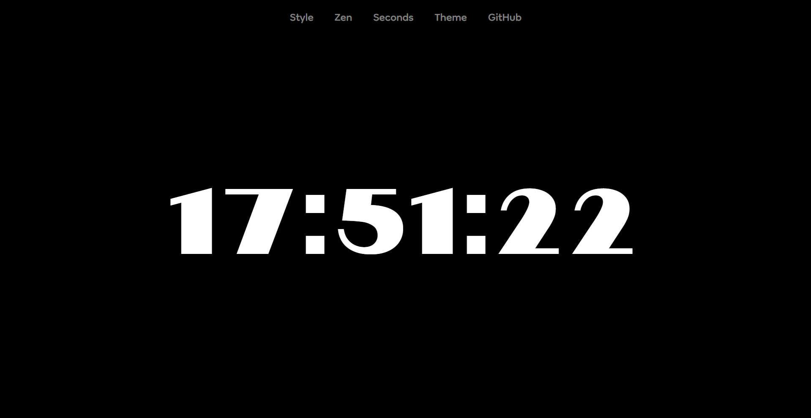
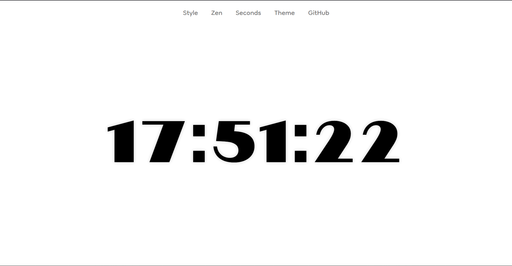
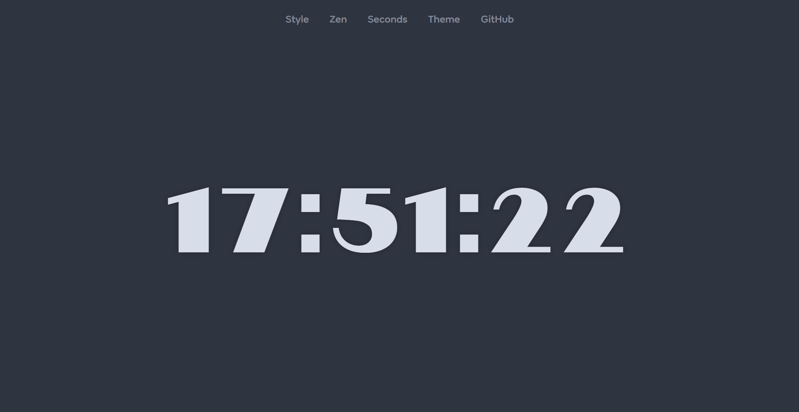
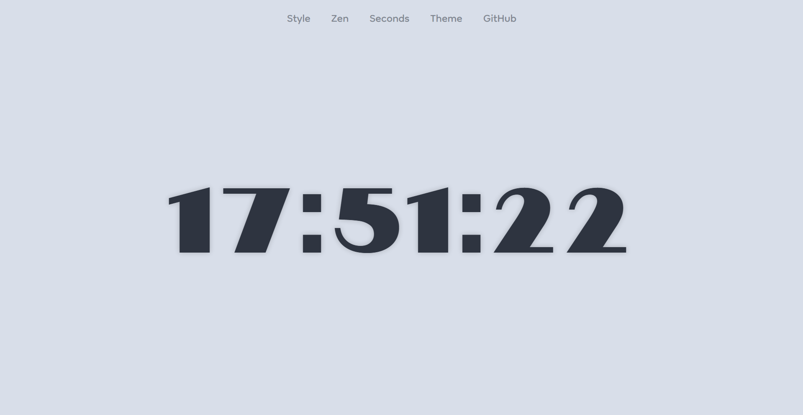
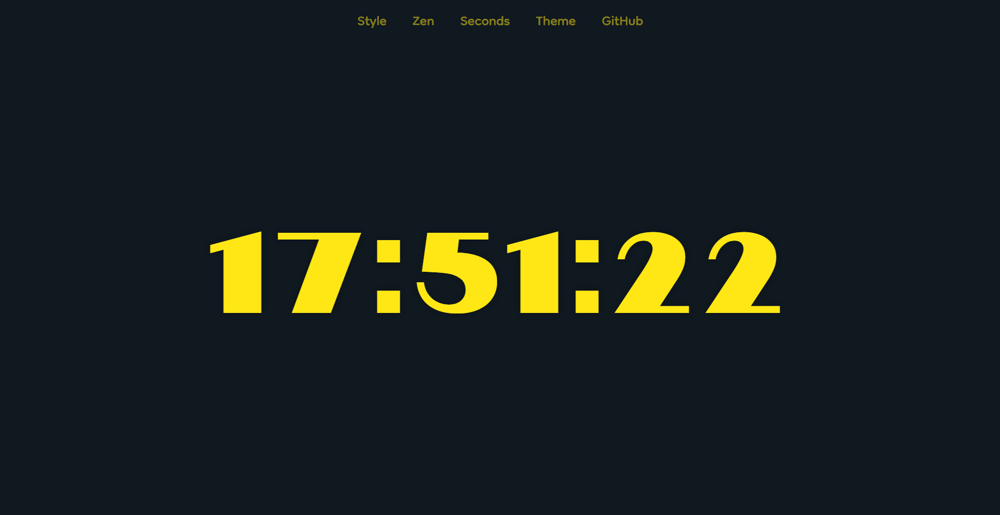
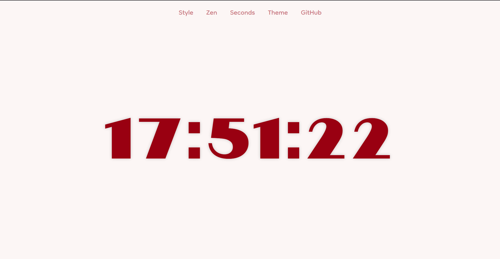
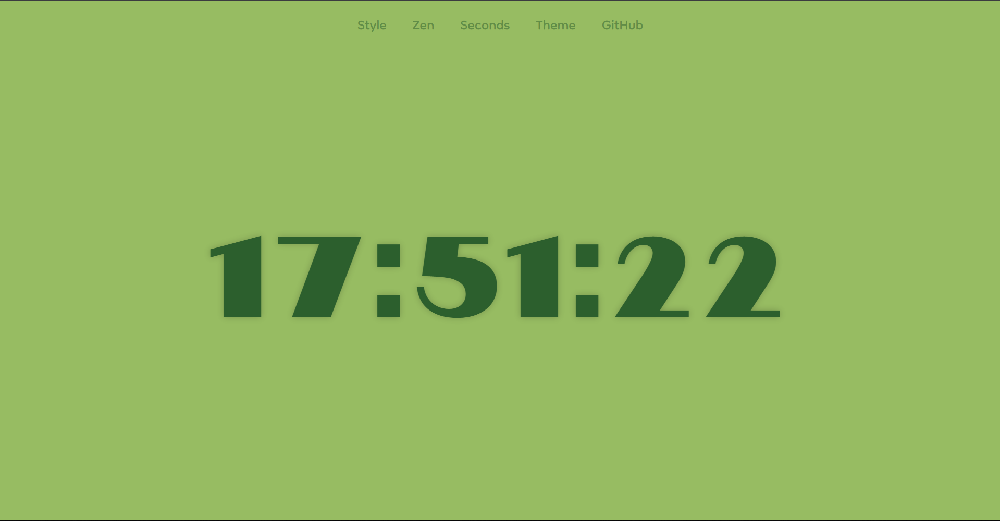
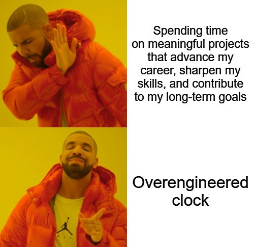

# Clock

> Because looking at your taskbar is way too mainstream.

Welcome to an over-engineered JavaScript clock. It tells the time (just like your phone), but this one is **yours**, made with **love**.

---

## ✨ Features

- ✅ Tells the current time (yes, that’s it).
- ⏱️ Updates **every single second** – like it actually cares.
- 🎨 Various Customisation options including 7 fonts and 8 themes. That's 56 unique clocks!
- 📈 Zero dependencies. 100% vanilla JavaScript goodness.

---

## 📦 Installation

Just clone this masterpiece into your life:

```bash
git clone https://github.com/nitintonypaul/clock.git
cd clock
```
Then just open `index.html` in your browser and watch time happen.

---

## 👀 Preview
















---

## 🧠 Fun Fact

This clock is so advanced that it does nothing else. No alarms. No time zones. No atomic sync.
Just pure, clean tick-tock.

---

## 🧼 Disclaimer

This project is for educational (and comedic) purposes. If your cat walks across your keyboard and deletes this repo, we are not liable.

---

## 📜 License
MIT – because we believe in free clocks for everyone.

---

### Made with ❤️ by a human who definitely lost track of time while building this.


